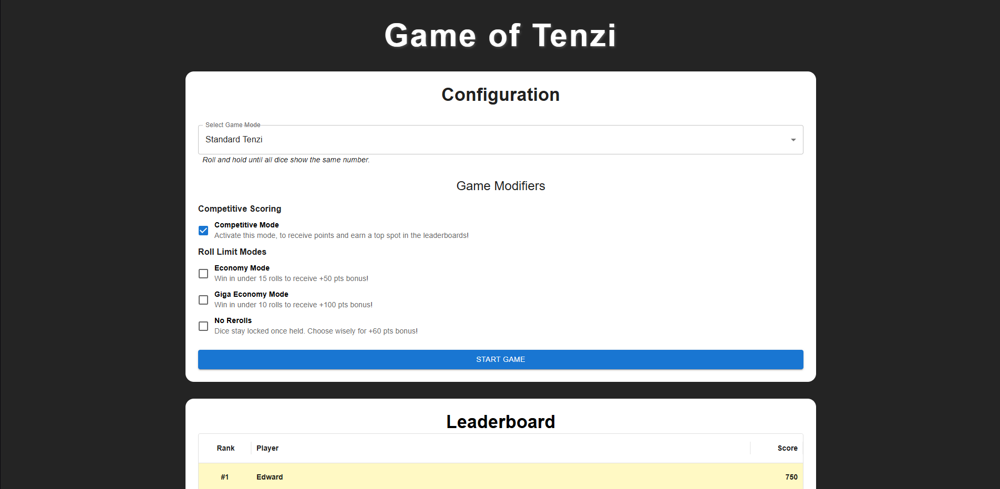

# 🎲 Game of Tenzi

A modern, feature-rich implementation of the popular dice game Tenzi, built with React, TypeScript, and Material-UI. Challenge yourself with multiple game modes, modifiers, and compete on the leaderboard!



## 🎮 What is Tenzi?

Tenzi is a fast-paced dice game where players race to get all their dice to show the same number. This digital version expands on the classic game with 12 unique game modes and various modifiers that add new challenges and strategic depth.

## ✨ Features

### 🎯 12 Game Modes

**Classic & Speedy:**

- **Standard Tenzi** - Roll and hold until all dice show the same number
- **Mega Tenzi** - Play with 20 dice instead of 10 for double the fun!
- **High Roller** - Get all dice to show 6s only
- **Low Roller** - Get all dice to show 1s only
- **Speed Tenzi** - Race against the clock to match all dice
- **Target Tenzi** - Declare a target number and match it with all dice

**Pattern & Logic:**

- **Splitzi** - Get 5 dice showing one number and 5 showing another
- **Odd/Even** - Roll until all dice show either odd or even numbers
- **Missingzi** - Go for 9 of one number, leaving one die out
- **Pairs Only** - Get 5 pairs of matching numbers
- **Pyramid** - Get 1 die showing 1, 2 showing 2s, 3 showing 3s, 4 showing 4s
- **Target Sum** - Achieve a specific sum with your dice

### 🔧 Game Modifiers

- **Economy Mode** - Win in under 15 rolls for +50 pts bonus
- **Giga Economy Mode** - Win in under 10 rolls for +100 pts bonus
- **No Rerolls** - Dice stay locked once held for +60 pts bonus
- **Competitive Mode** - Earn scores and compete on the leaderboard

### 🏆 Leaderboard System

- Track your best performances across all game modes
- Compare scores with different modifier combinations
- View roll count and time statistics

## 🛠️ Tech Stack

- **React 19** - Latest version with React Compiler enabled
- **TypeScript** - Type-safe development
- **Vite** - Lightning-fast build tool and dev server
- **Material-UI (MUI)** - Beautiful, responsive UI components
- **Zustand** - Lightweight state management

## 🚀 Getting Started

### Prerequisites

- Node.js (v16 or higher)
- npm or yarn

### Installation

1. Clone the repository:

```bash
git clone <repository-url>
cd game-of-tenzi
```

2. Install dependencies:

```bash
npm install
```

3. Start the development server:

```bash
npm run dev
```

4. Open your browser and navigate to `http://localhost:5173`

## 📜 Available Scripts

- `npm run dev` - Start development server
- `npm run build` - Build for production
- `npm run preview` - Preview production build locally
- `npm run lint` - Run ESLint for code quality

## 🎲 How to Play

1. **Choose Your Game Mode** - Select from 12 different game modes, each with unique win conditions
2. **Add Modifiers** (Optional) - Increase the challenge with roll limits or competitive scoring
3. **Start Rolling** - Click "Roll" to roll all unheld dice
4. **Hold Dice** - Click on dice to hold them at their current value
5. **Win** - Achieve the game mode's objective to win!
6. **Compete** - Enable Competitive Mode to save your score to the leaderboard

## 🎨 Key Features Implementation

- **State Management**: Zustand stores handle game state and leaderboard data
- **Responsive Design**: Fully responsive UI that works on mobile and desktop
- **Score Calculation**: Dynamic scoring system based on game modes and modifiers
- **Timer System**: Built-in timer for Speed Tenzi mode

## 📝 License

This project is open source and available under the MIT License.

## 🤝 Contributing

Contributions, issues, and feature requests are welcome! Feel free to check the issues page.

---

Built with ❤️ using React and TypeScript
